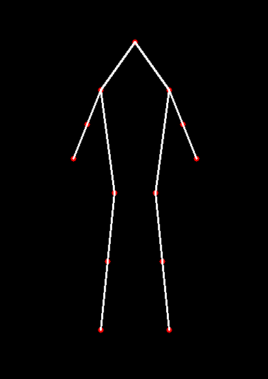

<h1> Draw a Human Figure From Keypoints</h1>
 
<h2>Features</h2>
<ul>
    <li>human_figure.py: using opencv to draw circles and lines from the corresponding keypoints</li>
</ul>

<h2>Acknowledgments</h2>

<b> Python3: http://bit.ly/python3-certifications </b>
 
<b> Machine Learning: https://bit.ly/machine-learning-certification <b>
 

<h2>Photo</h2>
<h4>Pose Drawn</h4>

 
<h2>Contact</h2>

<b> Email: mariusc0023@gmail.com </b>
